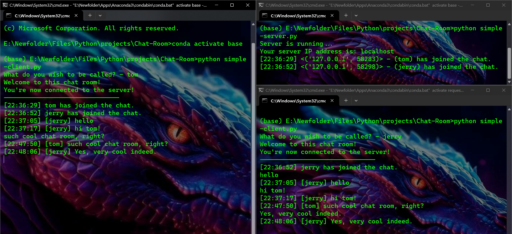

# Python_Chat-Room
[](https://shields.io/) 

[](https://github.com/KlausJackson/Chat-Room) 
[](https://github.com/KlausJackson/Chat-Room) 
[](https://github.com/KlausJackson/Chat-Room)
<br>

Python implementation of a simple chat room using TCP protocol. <br>
For fun only. I'm a newbie, please don't throw rocks. <br>

## Credits

Original idea and code: [NeuralNine](https://www.youtube.com/@NeuralNine) <br> 
Simple version: [Link](https://youtu.be/3UOyky9sEQY?si=ZfhIld_oTzGdTsgC) <br>
Advance version: [Link](https://youtu.be/F_JDA96AdEI?si=naX_kLDcCWYCMohQ) <br>

Special thanks to NeuralNine for his valuable content and tutorials.

My version is a little or maybe a lot different from NeuralNine. <br>
`/unban`, `/list`, `/banned`, `/quit` are ideas inspired by [Erkenbend's advance chat room version](https://github.com/Erkenbend/tcp-chat-room). <br>

## Requirements

Python 3.8 or higher 
Libraries and Frameworks used in this repository: 
- threading
- socket
- time <br>
They're all Python default library so no need to install anything except for Python 3.8 or higher.

## Preview

Preview of the simple version scripts on the same machine using 3 command prompt windows. <br>



## Usage

There are 2 versions of the chat room: simple and advance. <br>
* The simple version: has no authorities or commands at all. 
```
python3 simple-server.py
```
```
python3 simple-client.py
```
<br>

* The advance version: has ADMIN role, 7 available commands (description of each command below) and 2 small versions of the server: 
  * v1: to connect dfference machines because `/ban` also bans IP address. 
  ```
  python3 advance-server-v1.py
  ```

  * v2: can be used to run on the same machines with multiple terminal windows, `/ban` only bans alias, just log in under another alias. 
  ```
  python3 advance-server-v2.py
  ```

  For the client side: 
  ```
  python3 advance-client.py
  ```

* How to run the code: open the terminal in the location where you installed the code and type `python3 <name of the file>.py`. 

**NOTE**: 
- You have to run the server.py first to be able to connect the clients together and chat. 
- If you're running the scripts on the same machine, open separated terminal windows for each scripts. 
- Remember to navigate to the directory containing the .py file first before you run the script. 
- ADMIN password resets to 123 when you run `server.py`.
  
**Tip**:
- Open the folder that contains the script you need to run. 
- From the path box, type 'cmd' and command prompt with the path we need will open itself. Or you can copy the path and type command `cd <path>`. Both works. 

## Features

These commands are for ADMIN only:
- `/kick` : to kick a user (only kick the user, you can still re-connect).
- `/ban` : to ban a user (only ban the alias if it's a v1 server, ban alias along with IP address if it's a v2 server).
- `/unban` : to unban a user.
- `/list` : to show list of users who are in the server.
- `/banned` : to show list of users who are banned.
- `/pass` : to change your ADMIN password.
- `/quit` or `/q` : to shut down the server. 
- `/help` : to show detail description of all the commands available.
  
One command that normal users can use but ADMIN can't:  
- `/alias` : to change your alias.

**NOTE**: the server.py must be running all the time, otherwise every time you close it and run again, ADMIN password will be back to default: 123. But the banned list (ban.txt) is still the same, you can edit it manually or log in under ADMIN role and use the `/unban` command.

## The End

If you have any problem while running the code, feel free to file an issue. <br>

I will never add a function/feature to make someone an admin, there can only be one boss in a server. 
I might upgrade this to a modern looking GUI application using Qt Designer in the future. <br>

That's all I got. Enjoy!


