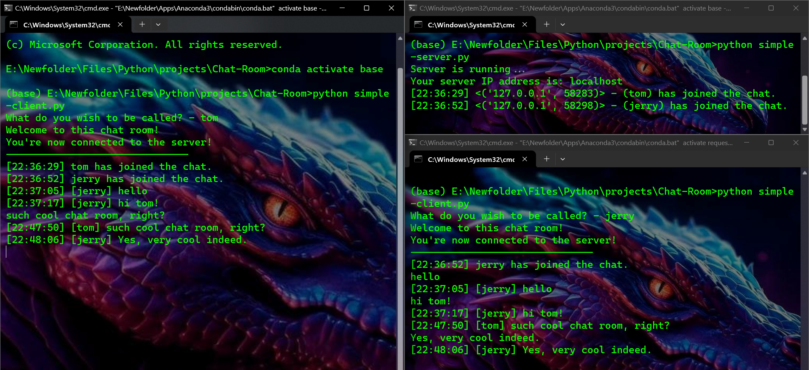

# Chat-Room

This repo first commit: [Jan 18, 2024](https://github.com/KlausJackson/Chat-Room/commits/main?after=2637ba4f72031e8af6516213d424f0ad5ac2f55d+69)

Python version has been discontinued. I won't make any new update.

## Preview

NodeJs

Python

## How To Contact Me

## Requirements, Usage, Features

For NodeJs: [README.md](Advance-chat-room/NodeJs/README.md)
For Python: [README.md](Advance-chat-room/Python/README.md)

## The End

If you have any problem while running the code or any ideas to improve it, feel free to file an issue.

I will never add a function/feature to make someone an admin, there can only be one boss in a server.
There will be updates for this repo in the future (bugs fixing if there's any, more features if I have ideas and time).

That's all I got. Enjoy!
